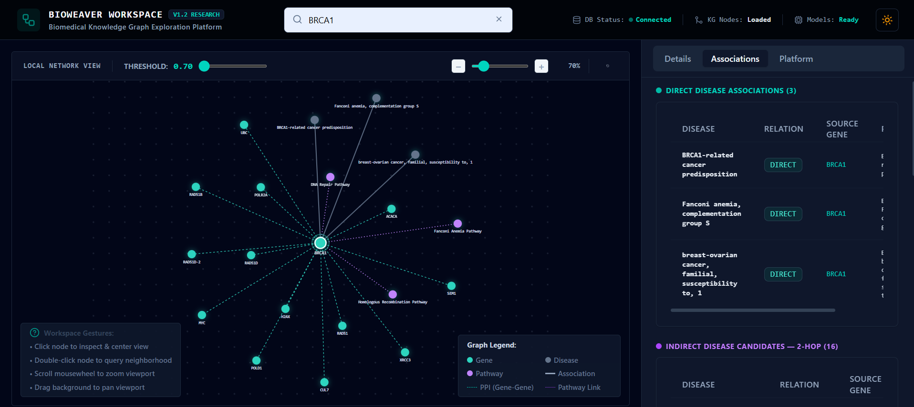

# BioWeaver

### AI-Powered Biomedical Knowledge Graph for Gene–Disease Discovery

BioWeaver is a full-stack biomedical intelligence platform that combines **Knowledge Graphs**, **Machine Learning**, and **Interactive Visualization** to explore relationships between genes, diseases, proteins, and biological pathways.

Built using data from the **Monarch Initiative** and **STRING Database**, BioWeaver enables researchers to discover direct disease associations, explore protein interaction networks, identify indirect disease candidates, and analyze biological evidence paths through an interactive graph workspace.

---

## Project Preview

<p align="center">
  
</p>

<p align="center">
  <em>Interactive exploration of gene–disease associations, protein interactions, biological pathways, and indirect disease discovery.</em>
</p>

---

## Why BioWeaver?

### Biomedical Knowledge Graph

```text
Monarch Initiative
        +
STRING Database
        │
        ▼
 Biomedical Knowledge Graph
        │
        ▼
 Gene • Disease • Pathway Network
```

### Machine Learning Pipeline

```text
Knowledge Graph
       │
       ▼
Node2Vec Embeddings (128D)
       │
       ▼
Feature Engineering (256D)
       │
       ▼
Random Forest Model
       │
       ▼
Association Analysis
```

### Interactive Research Workspace

```text
Search Gene
     │
     ▼
Direct Disease Associations
     │
     ▼
Associated Gene Network
     │
     ▼
Indirect Disease Discovery
     │
     ▼
Evidence Path Exploration
```

---
## Key Highlights

- Biomedical Knowledge Graph with **18,597 Nodes**
- Integrated **107,457 Biological Relationships**
- Combined Monarch and STRING datasets
- Node2Vec Graph Representation Learning
- Random Forest-Based Association Analysis
- Interactive React + FastAPI Workspace
- Direct and 2-Hop Disease Discovery
- Evidence Path Visualization

---

## Technology Stack

| Layer | Technologies |
|---------|-------------|
| Frontend | React, TypeScript, Vite, Tailwind CSS |
| Backend | FastAPI, Python |
| Graph Analytics | NetworkX, Node2Vec |
| Machine Learning | Scikit-Learn, Random Forest |
| Data Processing | Pandas, NumPy |

---

## Repository Structure

```text
BIOWEAVER
│
├── backend/
├── frontend/
├── data/
├── src/
│   ├── graph/
│   ├── embeddings/
│   ├── models/
│   └── evaluation/
│
├── notebooks/
├── docs/
└── README.md
```

---

## Future Enhancements

- Graph Neural Networks (GNNs)
- Explainable AI
- Drug–Gene–Disease Discovery
- Multi-Omics Integration
- Clinical Knowledge Integration

---

## Author

**Kathyayini Prabhu**  
Artificial Intelligence & Data Science

GitHub: https://github.com/Kathyayini26

---

## License

MIT License
